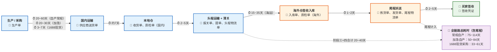

```mermaid
flowchart LR
    classDef china_style fill:#e3f2fd,stroke:#1565c0,stroke-width:2px;
    classDef abroad_style fill:#fff3e0,stroke:#e65100,stroke-width:2px;
    classDef end_style fill:#e8f5e9,stroke:#2e7d32,stroke-width:2px;
    classDef note_style fill:#f3e5f5,stroke:#6a1b9a,stroke-width:1px,dashed;

    A["<b>生产 / 采购</b><br>📄 生产单"]:::china_style
    B["<b>国内运输</b><br>📄 供应商送货单"]:::china_style
    C["<b>本地仓</b><br>📄 收货单、质检单（国内）"]:::china_style
    D["<b>头程运输 + 清关</b><br>📄 报关单、提单、头程物流单"]:::china_style
    E["<b>海外仓签收入库</b><br>📄 入库单、质检单（海外）"]:::abroad_style
    F["<b>尾程派送</b><br>📄 拣货单、发货单、尾程物流单"]:::abroad_style
    G["<b>🏁 买家签收</b><br>📄 签收凭证"]:::end_style

    A -->|⏱ 20~60天（自产常规）<br>⏱ 20~30天（加急）<br>⏱ 3~7天（1688现货）| B
    B -->|⏱ 约7天| C
    C -->|⏱ 2~5天| D
    D -->|⏱ 15~35天（海运）| E
    E -->|⏱ 1~2天| F
    F -->|⏱ 2~5天| G

    H["<b>📅 全链路总耗时（含尾程）</b><br>常规自产：75~114天<br>加急自产：50~84天<br>1688现货采购：33~61天"]:::note_style
    D -.->|阶段三+四合计 20~40天| H
    F -.->|尾程计入| H
```
